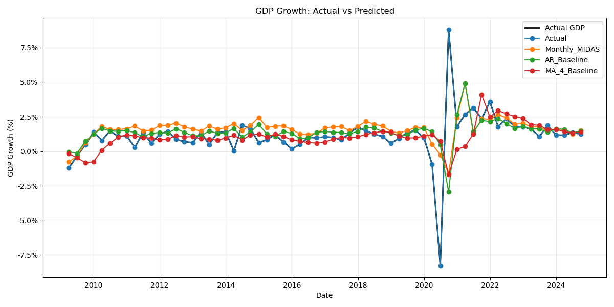
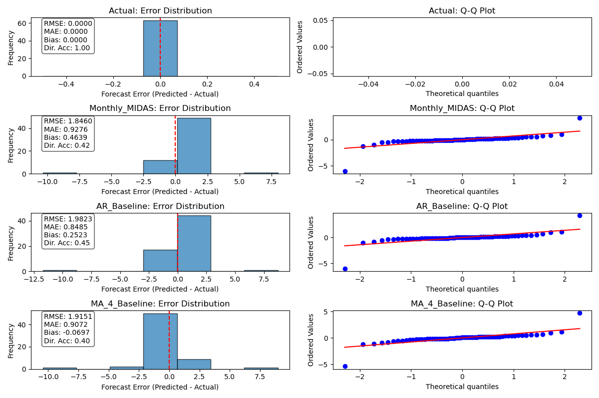
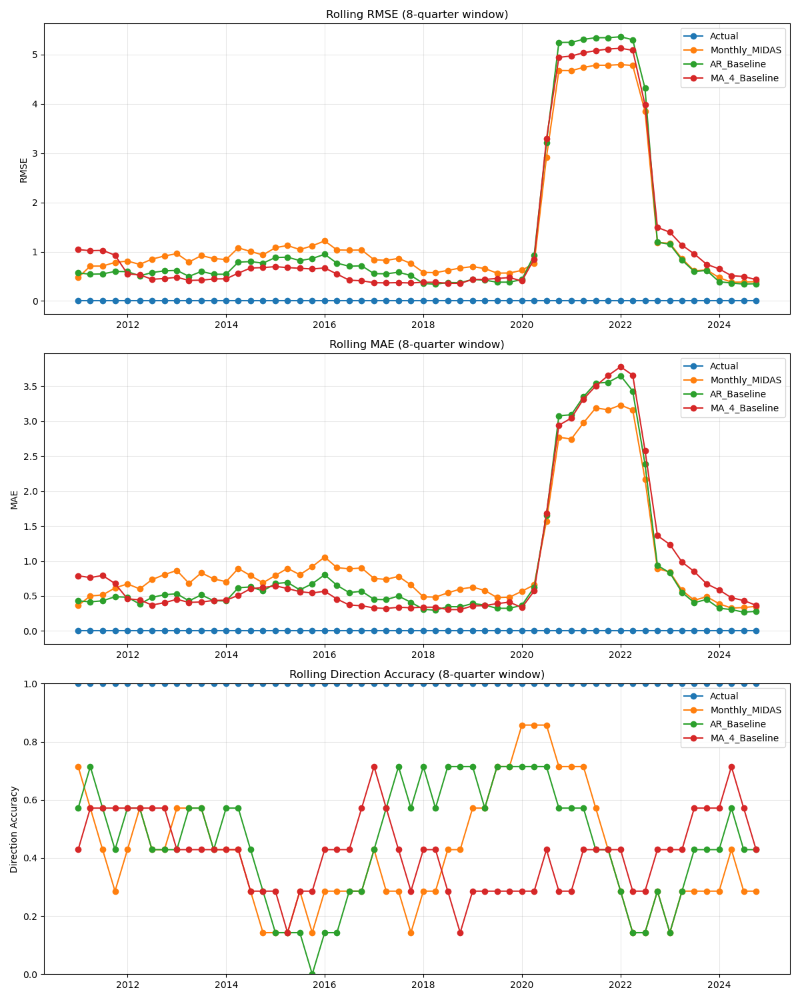

# GDP Forecasting Model Evaluation Report

Generated on: 2025-05-09 14:09

## Models Evaluated

Number of models: 4
Evaluation period: 2009-03-31 00:00:00 to 2024-09-30 00:00:00
Number of observations: 63

## Performance Metrics

| Model | RMSE | MAE | MAPE | R² | Direction Accuracy | Theil's U | Bias |
|-------|------|-----|------|----|--------------------|-----------|------|
| Actual | 0.0000 | 0.0000 | 0.00% | 1.0000 | 1.00 | 0.0000 | 0.0000 |
| Monthly_MIDAS | 1.8460 | 0.9276 | 175.57% | -0.1641 | 0.42 | 0.7076 | 0.4639 |
| AR_Baseline | 1.9823 | 0.8485 | 142.28% | -0.3423 | 0.45 | 0.7598 | 0.2523 |
| MA_4_Baseline | 1.9151 | 0.9072 | 114.56% | -0.2529 | 0.40 | 0.7341 | -0.0697 |

## Detailed Model Analysis

### Actual

#### Directional Forecast Confusion Matrix

| | Predicted Up | Predicted Down |
|------------|--------------|----------------|
| **Actual Up** | 29 | 0 |
| **Actual Down** | 0 | 34 |

#### Additional Metrics

* Mean Directional Accuracy: 0.9841
* Hit Rate (% of Up movements correctly predicted): 1.0000
* False Alarm Rate: 0.0000
* Bias (Average overestimation): 0.0000

### Monthly_MIDAS

#### Directional Forecast Confusion Matrix

| | Predicted Up | Predicted Down |
|------------|--------------|----------------|
| **Actual Up** | 13 | 16 |
| **Actual Down** | 20 | 14 |

#### Additional Metrics

* Mean Directional Accuracy: 0.4127
* Hit Rate (% of Up movements correctly predicted): 0.4483
* False Alarm Rate: 0.5882
* Bias (Average overestimation): 0.4639

### AR_Baseline

#### Directional Forecast Confusion Matrix

| | Predicted Up | Predicted Down |
|------------|--------------|----------------|
| **Actual Up** | 12 | 17 |
| **Actual Down** | 17 | 17 |

#### Additional Metrics

* Mean Directional Accuracy: 0.4444
* Hit Rate (% of Up movements correctly predicted): 0.4138
* False Alarm Rate: 0.5000
* Bias (Average overestimation): 0.2523

### MA_4_Baseline

#### Directional Forecast Confusion Matrix

| | Predicted Up | Predicted Down |
|------------|--------------|----------------|
| **Actual Up** | 11 | 18 |
| **Actual Down** | 19 | 15 |

#### Additional Metrics

* Mean Directional Accuracy: 0.3968
* Hit Rate (% of Up movements correctly predicted): 0.3793
* False Alarm Rate: 0.5588
* Bias (Average overestimation): -0.0697

## Model Comparison: Diebold-Mariano Test

| Model 1 | Model 2 | DM Statistic | p-value | Conclusion |
|---------|---------|--------------|---------|------------|
| Actual | Monthly_MIDAS | -19.9085 | 0.0000 | Model 1 is more accurate *** |
| Actual | AR_Baseline | -22.9878 | 0.0000 | Model 1 is more accurate *** |
| Actual | MA_4_Baseline | -20.6925 | 0.0000 | Model 1 is more accurate *** |
| Monthly_MIDAS | AR_Baseline | -3.1294 | 0.0018 | Model 1 is more accurate *** |
| Monthly_MIDAS | MA_4_Baseline | -1.7218 | 0.0851 | No significant difference |
| AR_Baseline | MA_4_Baseline | 2.7739 | 0.0055 | Model 2 is more accurate *** |

*Significance levels: *** = 1%, ** = 5%, * = 10%

## Conclusion

Based on RMSE, the best performing model is **Actual**.

Based on directional accuracy, the best performing model is **Actual**.

## Visualizations

### Forecast Comparison

### Error Distribution

### Rolling Metrics

